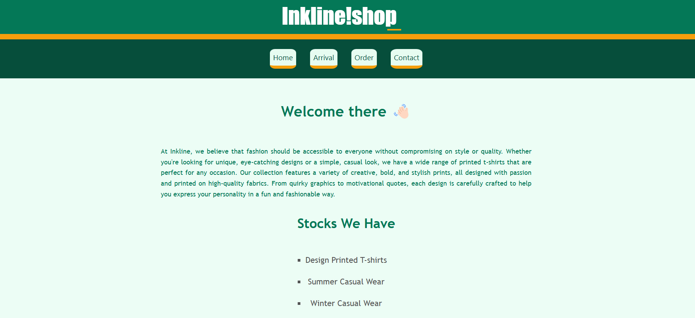
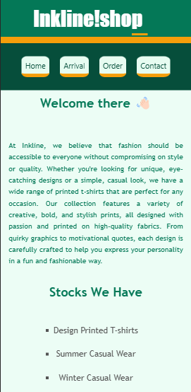
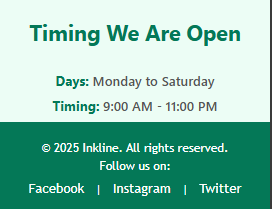

# Create a static webpage layout using semantic elements.

# Tags used in Task-1
- `<header>` - Defines a Header section of the webpage (Which is present at top)
- `<nav>` - Defines a Navbar of the page (which helps to render and navigate)
- `<main>` - Defines a Main Content for the webpage (which is at the center)
- `<footer>` - Represents the footer of the webpage (which is at the end of the page)

- `<ul>` - Represents the un-ordered list (groups the list)
- `<li>` -  Defines the list
- `<h1>` - Main heading of the page
- `<h2>` - Secondary heading of the page
- `
` - Represented as Paragraph which contains the paragraph content

_Created a Static Webpage (Inkline Shop)_

## Output Images for Web view

## Output Images for Mobile view

