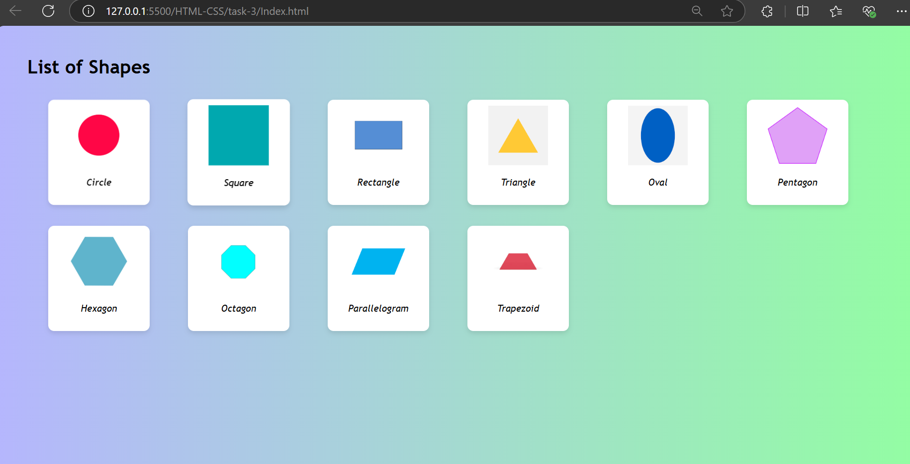
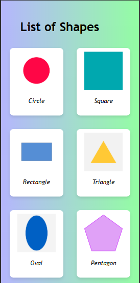

# Responsive Grid Layout

## Created a Webpage that show the list of shapes in a responsive grid view
- Used a basic hmtl and css elements
### Grid elements:
- `display:grid` - Represent the customizable rows and columns structure 
- `grid-template-columns: repeat(6, 0.2fr)` - Displays the grid in 6 items per row with a 0.3 fractional unit of available space
- `grid-gap` - Defines a space between those grid elements

``` bash

.grid_container{
    display: grid;
    grid-template-columns: repeat(6, 0.2fr);
    grid-gap: 5px;
    margin: 20px;
    justify-content: center;
}
```


## Output Images for Web view


## Output Images for Mobile view
