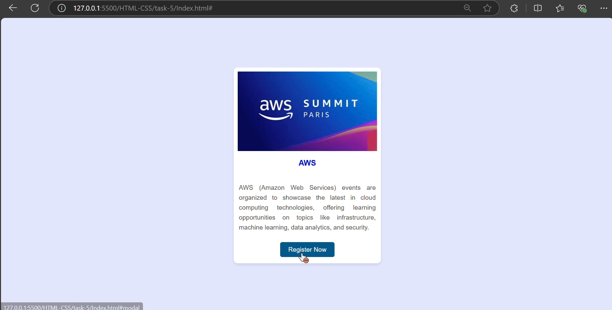
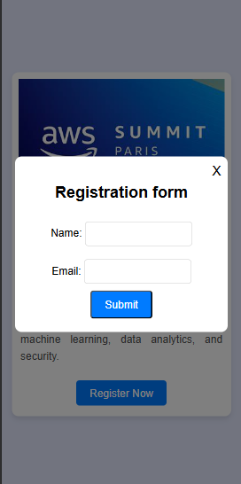

# Modal Popup Using the :target

## Created a webpage that will allow the user to book their slots for upcoming events

- Used a basic html and css tags 
- `:target`- Style a specific element that matches the fragment identifier in the URL
```
#modal:target {
    display: flex;
    opacity: 1;
}
```

- `opacity` - helps to control the visibility of the modal 
```
.modal {
    display: none;
    position: fixed;
    top: 0;
    left: 0;
    width: 100%;
    height: 100%;
    background-color: rgba(0, 0, 0, 0.5);
    align-items: center;
    justify-content: center;
    opacity: 0;
}
```

## Output Images for Web View


## Output Image for Mobile View
