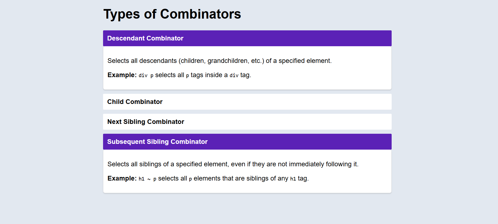

# CSS Accordion Component

## Created a webpage that explains the types of Combinators and its explanation

## Html tags used:
- ` <div class="accordion">` - Defines a container which holds the items of accordion
- `<div class="accordion-item">`- Acts as a container to hold heading and content of the accordion
- `<input type="checkbox" id="section1">`- Defines the checkout input which allows to open `multiple accordion`
- `  <label for="section1" class="accordion-header">` - Acts as a label as well as header of the accordion
- `<div class="accordion-content">` - It will store the content for particular accordion

## CSS elements:
- `display: none;` - to hide the checkbox and accordion-content (initally)
- To create a smooth transitions
```
 transition: max-height 0.3s ease-in-out, padding 0.3s ease-in-out;
 ```
 - Make the accordion content visible when `checkbox's label` is checked 
 ```
 
input[type="checkbox"]:checked+.accordion-header+.accordion-content {
    display: block;
    max-height: 500px;
    padding-top: 10px;
    padding-bottom: 10px;
}
```
- This allow to make the accordion header active when it is open
```
input[type="checkbox"]:checked~.accordion-header {
    background-color: #5B21B6;
    color: white;
}
```
```
`label` <-> `checkbox`
`label -> (click) -> checkbox triggered-- make a bg active 
                                  |
                                  |
                            display content
```

## Output Images for Web View


## Output Images for Mobile View 
