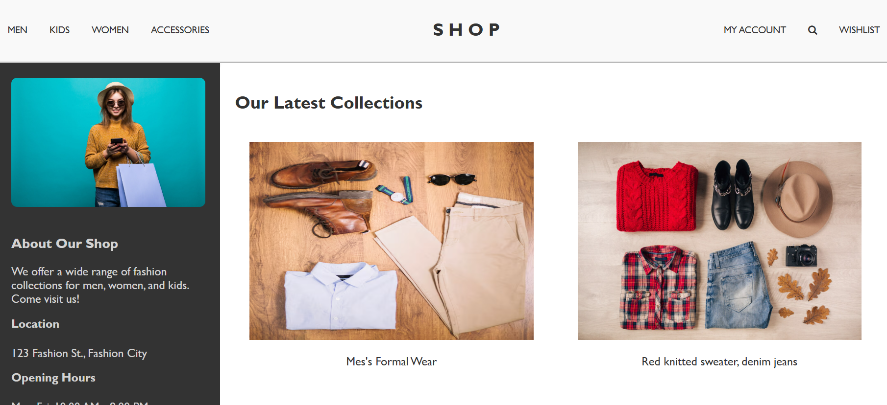
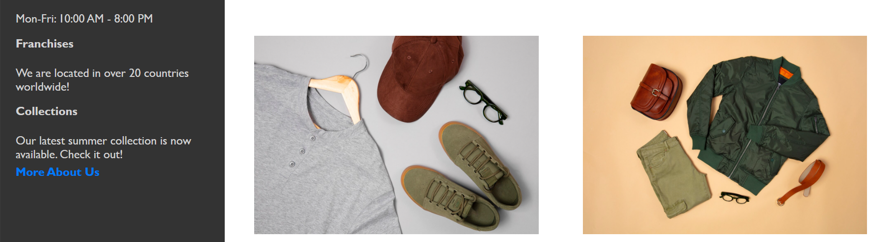
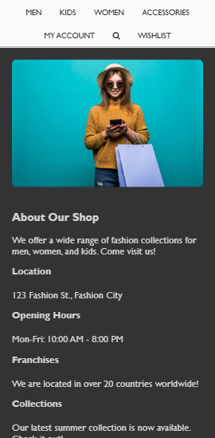
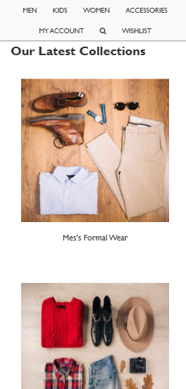

# Complex Responsive Layout with Grid and Flexbox

## Created a webpage (Clothing Collection) - with sticky header, and grid layout content

## Html tages used
| **HTML Tag** | **Description** |
|--------------|-----------------|
| `
`      | Defines a main section that holds a content|
| `<aside class="sidebar">`    | Represents content that is tangentially related to the content around it (sidebar). |
| `<nav class="navbar">`      | Defines navbar for the page |
| `ul`   | Represents a unordered list. |
| `
`   | Represents a content below the header which holds a sidebar and main_content. |
| `
`  | Represents a main content of the page which have a layout to show the collections. |
| `
`  | Used to hold the collection items 

## CSS Elements used
| **CSS Elements** | **Description** |
|--------------|-----------------|
| `position: sticky`      | Keeps the element fixed while scrolling|
| `z-index: 1000`    | sets the stacking order of an element. |
| `display: grid`      | Defines grid display view |
| `grid-template-columns: 1fr 3fr`   | Splits up the layout with 1 fractional unit for sidebar and 3 fractional unit for main content. |
| `  grid-template-columns: repeat(2, 1fr)`   | Represents a two columns with one fractional unit. |

## Output Images for Web View

## Output Images for Mobile View

